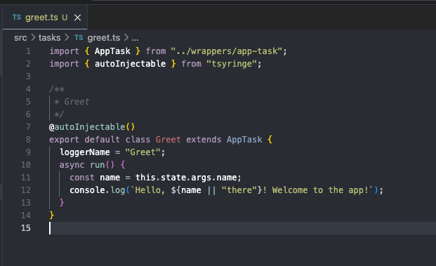
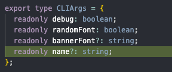

## task-script-support

A lightweight library for writing task oriented scripts.

Uses the following:

- [immutable](https://www.npmjs.com/package/immutable) (state management)
- [pino](https://www.npmjs.com/package/pino) (logging)

## Getting Started

There is a scaffolding tool you can make use of for getting started.

It can be installed globally via:

```bash
npm i -g task-script-support-cli
```

Run the following to verify installation:

```bash
tssc -v
```

## Intoduction

📂 **New Project**

Create a new project with the `new` command.

```bash
tssc new -n "my-awesome-project"

cd ./my-awesome-project && npm i && npm start -- --help
```

⚡ **Resource Generation**

Use the `gen` command to generate new `task`, `service`, or `command` class.

For example we can generate a new greet task to say hello.

```bash
tssc gen --task -n "greet"
```

Modify the new task to log a message. You can reference the cli args in the task classes.



If we add a new cli arg we modify the `CLIArgs` type to reflect that option.

```bash
code ./src/types/state.ts
```



🔌 **Create Command**

When a command is generated it prompts for the tasks the command will execute.

```bash
tssc gen --command -n "hello command"

# select the greet task, and others and order them as needed
```

<sub>(Note: ordered tasks are exectued sequentially but you can wrap them in square brackets `[]` for concurrent execution. Mix and match to create sync points and advanced workflows)</sub>

We can register the new command in our `./src/index.ts` file by adding the import and command to yargs:

```typescript
// ...

import { HelloCommand } from "./commands/hello-command";

  // ...

  .command(
    "hello",
    "greet the user",
    (yargs) => {
      yargs.option("n", {
        alias: "name",
        type: "string",
        describe: "the name of the user to greet",
      });
    },
    container.resolve(HelloCommand).handler,
  )
```

and run it to test things out.

```bash
npm start -- hello -n "Max Headroom"
# outputs:
# Hello, Max Headroom! Welcome to the app!
```
